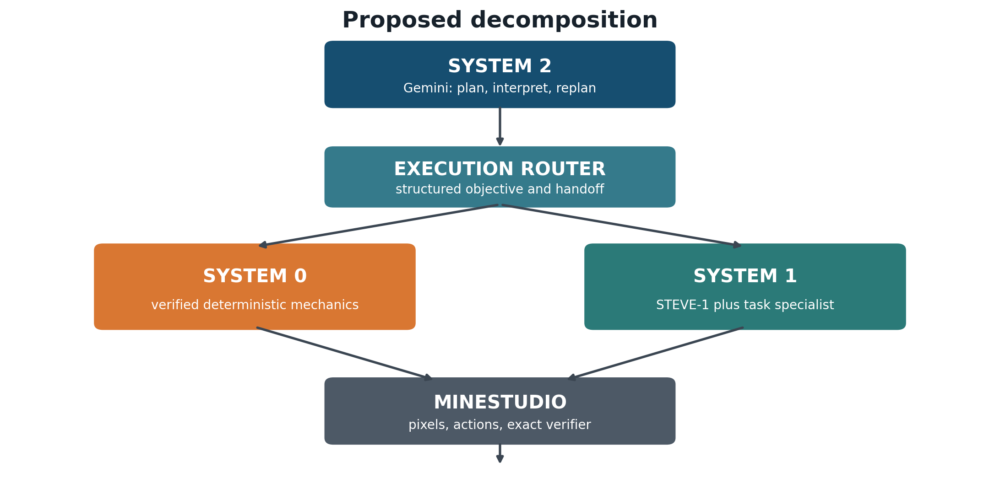
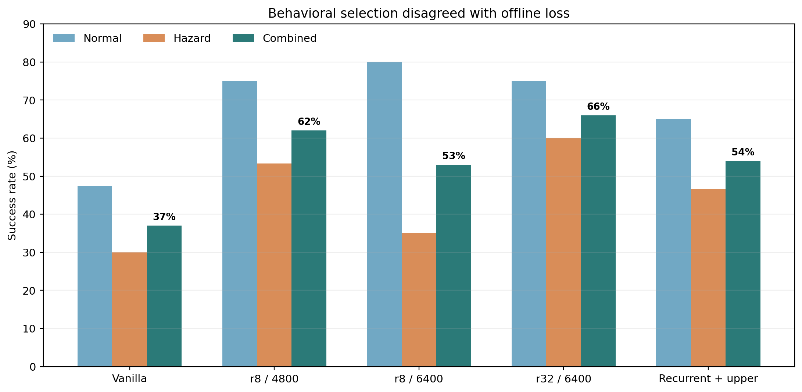
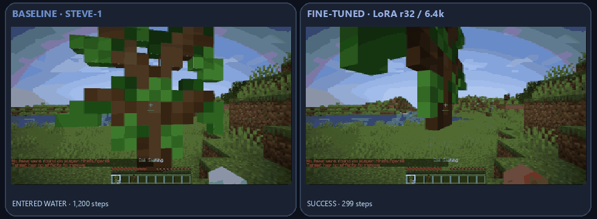
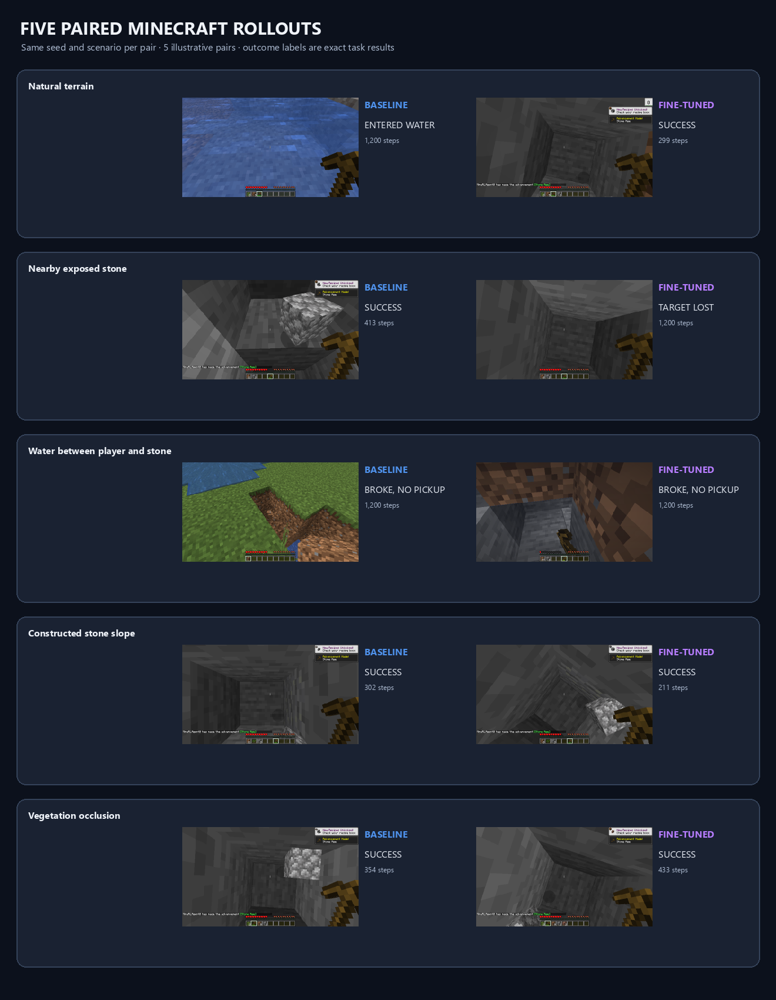

# MineStudio: Hierarchical Minecraft Agent

A research fork of [MineStudio](https://github.com/CraftJarvis/MineStudio) exploring a three-part Minecraft agent: deterministic mechanics (System 0), a pretrained visuomotor policy (System 1), and a higher-level planner (System 2). The goal is to connect these layers through explicit task contracts and state-based verification, then measure whether the combination reliably completes useful Minecraft objectives.

**Status: work in progress.** A narrow stone-acquisition benchmark has a measurable policy result; the full hierarchy remains incomplete. The current project does not reliably progress to iron tools, and the live System 2-to-System 1 loop has not been validated end to end.



## How the agent is organized

- **System 0 — deterministic mechanics.** A typed skill registry exposes bounded actions such as mining a known target, collecting a known drop, crafting a recipe, equipping an item, and placing or reclaiming blocks. Contracts declare parameters, preconditions, success and failure predicates, timeouts, and abort conditions. Missing or uncertain visual information routes to System 1; failed preconditions are returned for replanning. It is not intended to search unseen terrain or choose strategic goals.
- **System 1 — Minecraft control.** MineStudio runs a pretrained STEVE-1/VPT-derived policy. Targeted LoRA checkpoints and task-specialist behavior are evaluated for local skills such as acquiring stone and recovering from hazards. The policy is imperfect and remains environment- and task-specific.
- **System 2 — planning.** A Gemini-based coach turns the global objective and recent gameplay context into one structured, verifiable local task at a time. The current interactive coach includes a human player in the control loop. Some offline policy evaluations use a frozen event-driven task bank rather than live planner calls, so those results do not establish autonomous planner performance.
- **MineStudio — simulator and verifier.** Minecraft observations, actions, inventory changes, and events are used to check task completion. Exact state predicates take precedence over a model's visual judgment.

The diagram describes the intended decomposition; it should not be read as proof that every connection is already implemented or validated.

## Results so far

### Stone acquisition

In a paired 100-episode screen of the combined normal and hazard conditions, the selected `upper_lora_r32_step6400` checkpoint completed the narrow stone-acquisition task in **66%** of episodes, compared with **37%** for the vanilla reference. The paired bootstrap 95% interval for the difference was **+17 to +41 percentage points** (McNemar exact *p* ≈ 8.96×10⁻⁶). This result applies to that benchmark and task; it is not a general Minecraft success rate.



### Watch the policies

These paired, fast-forwarded POV clips use the same world seed and scenario for both policies. The selected checkpoint is `upper_lora_r32_step6400`; each run gets the goal “obtain 3 cobblestone.” Actions are sampled, so each pair is one illustrative rollout. In the natural-terrain example, the baseline enters water and misses the goal by step 1,200; the fine-tuned policy succeeds in 299 steps. In the exposed-near example, the baseline succeeds in 413 steps while the fine-tuned policy loses the target and times out at 1,200. Both policies also miss the goal in the water-near-stone example. The five clips are curated illustrations, not a performance estimate; the paired 100-episode screen above is the statistical comparison.

[](media/stone-acquisition/paired-natural.mp4)

[](media/stone-acquisition/protocol.json)

[Natural-terrain MP4](media/stone-acquisition/paired-natural.mp4) · [Run seeds, checkpoints, and full outcomes](media/stone-acquisition/protocol.json)

| Scenario | Baseline STEVE-1 | Fine-tuned LoRA r32/6400 | Clip |
| --- | --- | --- | --- |
| Natural terrain | `ENTERED_WATER` · 1,200 steps | `SUCCESS` · 299 steps | [Watch GIF](media/stone-acquisition/paired-natural.gif) |
| Nearby exposed stone | `SUCCESS` · 413 steps | `TARGET_LOST` · 1,200 steps | [Watch GIF](media/stone-acquisition/paired-exposed_near.gif) |
| Water between player and stone | `STONE_BROKEN_NOT_COLLECTED` · 1,200 steps | `STONE_BROKEN_NOT_COLLECTED` · 1,200 steps | [Watch GIF](media/stone-acquisition/paired-water_near_stone.gif) |
| Constructed stone slope | `SUCCESS` · 302 steps | `SUCCESS` · 211 steps | [Watch GIF](media/stone-acquisition/paired-stone_slope.gif) |
| Vegetation occlusion | `SUCCESS` · 354 steps | `SUCCESS` · 433 steps | [Watch GIF](media/stone-acquisition/paired-vegetation_occluded.gif) |

Individual natural-terrain clips: [baseline STEVE-1](media/stone-acquisition/natural-baseline.gif) · [fine-tuned policy](media/stone-acquisition/natural-finetuned.gif).

### Follow-up attempts

- A System 0 router/pickup ablation did not improve on the 66% reference in its paired 100-episode comparison; the tested replacement reached 57% (95% interval for the difference: −20 to +2 points).
- A targeted PPO System 1 candidate reached 54% in a paired 100-episode stone evaluation versus 66% for its reference checkpoint. It was **not promoted**.
- In the latest iron-pickaxe viability run, 22 of 24 planned episodes were valid. **Zero** completed an iron pickaxe; 15 reached a stone pickaxe, 2 obtained raw iron, and none produced iron ingots.

The results are mixed by design: the code and reports retain regressions and failed milestones instead of presenting them as solved. Compact aggregate reports and the plotted figures are in [`paper/evidence`](paper/evidence) and [`paper/figures`](paper/figures); large episode traces, checkpoints, recordings, and run outputs stay outside Git.

## Repository map

- `minestudio/system_zero/` — skill contracts, registry, execution router, and legacy controller backend.
- `minestudio/tutorials/simulator/gemini_coach.py` — interactive Gemini task coach and recording path.
- `run/` — task benchmarks, checkpoint evaluation, training and analysis scripts, System 0 smoke tests, and run helpers.
- `tests/test_system_zero.py` — isolated contract and routing tests.
- `paper/main.tex` and `paper/figures/` — research write-up and figures.
- `PROJECT.md` — broader design specification; many proposed components remain future work.
- `LOCAL_SETUP.md` — current Windows/WSL2 setup notes.

The underlying simulator, data, model, training, and inference framework comes from the upstream [MineStudio project](https://github.com/CraftJarvis/MineStudio) and its [documentation](https://craftjarvis.github.io/MineStudio/). This repository preserves that upstream attribution and license.

## Setup and checks

The Minecraft simulator is currently run in WSL2/Linux; the native Windows launcher is unsupported. Follow [`LOCAL_SETUP.md`](LOCAL_SETUP.md) for the tested local setup. The DGX scripts use the existing shared environment; they are not installation instructions for a clean machine.

The System 0 contract tests do not launch Minecraft:

```bash
python -m unittest discover -s tests -p test_system_zero.py -v
```

The live simulator smoke test launches Minecraft and is a separate check:

```bash
python run/system_zero_smoke_test.py
```

Set `MINESTUDIO_SYSTEM_ZERO_ATTEMPTS` only when intentionally choosing the number of live attempts per skill. Training and benchmark commands can consume substantial GPU time; inspect each runner's configuration before starting one.

## Current limits

- No iron pickaxe has been achieved in the latest viability evaluation.
- The 66% result covers one bounded stone task and a fixed paired screen, not open-ended survival or long-horizon objectives.
- The System 0 router changes and targeted PPO follow-up did not improve the reference under their reported evaluations.
- Frozen task-bank evaluations do not measure live Gemini planning, and the interactive coach still uses a human player.
- The simulator and pretrained policies have substantial environment, dependency, and hardware requirements.

## Acknowledgements

This work builds on the open-source MineStudio framework and its MineRL/Project Malmo integrations. See the upstream repository for its contributors, model and dataset credits, citation, and license details.
